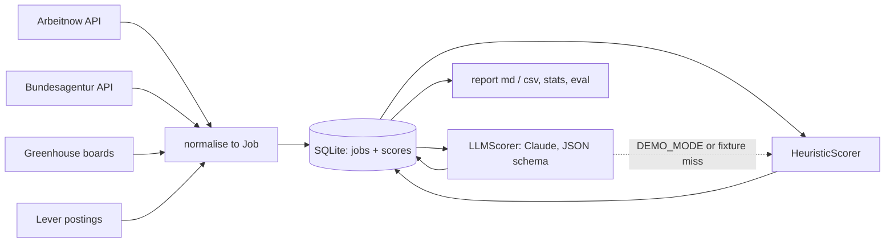

# eu-job-pipeline

Pulls job postings from four public European sources into one SQLite store and scores each one against a candidate profile, either with a deterministic rule-based scorer (offline, free) or with Claude through structured outputs (live, measured for cost). I built it for my own relocation search; the design is the same one I use for document pipelines at work.

 

**Status:** active development (September 2026) · **Runs offline:** yes, `DEMO_MODE=true` needs no key and no network

```
$ eu-jobs report --top 5

| # | Fit | Verdict | Title               | Company                | Location            | Visa    | Language | Seniority | Workplace |
|---|-----|---------|---------------------|------------------------|---------------------|---------|----------|-----------|-----------|
| 1 | 82  | strong  | Data Engineer       | Alpenstein AG          | Zurich, Switzerland | yes     | english  | mid       | remote    |
| 2 | 77  | strong  | Data Engineer       | Seine Intelligence SAS | Paris, France       | unknown | english  | mid       | remote    |
| 3 | 77  | strong  | LLM Engineer        | Alpenstein AG          | Zurich, Switzerland | unknown | english  | mid       | hybrid    |
| 4 | 76  | strong  | Applied AI Engineer | Alpenstein AG          | Zurich, Switzerland | yes     | english  | mid       | remote    |
| 5 | 76  | strong  | Junior AI Engineer  | Alpenstein AG          | Zurich, Switzerland | yes     | english  | junior    | onsite    |
```

All companies above are fictional demo data.

## The problem

Searching for a job across Europe from Brazil means reading hundreds of postings a week across boards that do not talk to each other, and most of the reading is spent on three questions the posting answers in one line if at all: does it sponsor a visa, does it require German, and is the seniority reachable. I wanted a pipeline that answers those three questions for every posting, keeps the ones it has seen, and lets me compare a cheap rule-based screen with an LLM screen on the same data.

## What it does

- Fetches postings from Arbeitnow, the Bundesagentur für Arbeit Jobsuche API, and any Greenhouse or Lever board you list, into one SQLite file, without duplicates across runs.
- Scores every posting for one candidate profile: fit 0 to 100, verdict, visa sponsorship, working language, seniority, workplace, and the reasons.
- Two interchangeable scorers behind one interface: a deterministic heuristic (free, offline, explainable) and Claude with a strict JSON schema (live; also through the Message Batches API at half price).
- Evaluates any scorer against a labelled golden set with one command, so a prompt or rule change is measured, not felt.
- Reports the best matches as Markdown or CSV and prints token usage and cost per scorer.

## Architecture



Each source turns a public API into `Job` records keyed by `source:external_id`; the store upserts them. A scorer takes a `Job` and returns a validated `ScoreRecord` with provenance (which scorer, which model, tokens, latency). The factory is the only module that reads `DEMO_MODE`: in demo mode the HTTP client serves recorded fixtures and the scorer is the heuristic; in live mode the same code hits the real APIs and Claude.

## Design decisions

- **The heuristic scorer is a real scorer, not a mock.** It runs in demo mode, it is the fallback when the LLM answer is missing or malformed, and it is evaluated against the same golden set as the LLM. Cost: a few dozen regexes to maintain. Gain: the LLM's added value becomes a number, and the demo runs anywhere.
- **Structured outputs with a hand-written flat schema, then Pydantic.** The JSON schema handed to Claude guarantees shape and enums; Pydantic's model then clamps the ranges a schema cannot express (fit 0 to 100, at most five reasons). I did not pass Pydantic's generated schema straight through: it emits `title` and numeric bounds the structured-output validator rejects. A malformed answer never reaches the store; it is logged and the job gets the heuristic score, with the scorer name recorded.
- **Message Batches for bulk scoring.** `eu-jobs score --batch` submits every unscored posting in one batch, polls, and keys results by `custom_id`. Half the token price, restartable, and no rate-limit dance. Cost: results arrive in minutes to hours, which is fine for a nightly run.
- **One SQLite file as the whole state.** Idempotent upserts keyed by `source:external_id`, scores overwritten on re-score, token counts stored per row. No server, trivially inspectable, and `stats` can compute real cost from what was actually spent.
- **Prompt caching only where it pays.** The rubric plus the candidate profile is identical for every posting and sits first in the system prompt with `cache_control`; the posting is the only thing that changes. `stats` shows `cache_read_tokens` so the saving is visible, not assumed.
- **Client-side filtering with word boundaries.** Three of the four sources have no server-side search. The first version matched substrings and "AI engineer" matched "maintain"; matching whole words fixed it and the fixture counts became stable.

## How AI was used

- **Generated:** the first version of every module (sources, store, scorers, CLI, tests) with an AI coding assistant, from a written design and the official SDK reference for structured outputs and batches.
- **Rewritten by me:** the heuristic's regexes after the golden set exposed misses (a year range such as "2-5 years" was read as senior; "valid EU work permit" was not recognised as a no-sponsorship signal); the source filter, from substring to word-boundary matching; the console output, made ASCII-only after an arrow character crashed on a Windows code page; the fixture dates and the test expectations that depended on them.
- **Validated:** 45 tests run in CI in demo mode; every scorer answer is schema-validated and clamped before storage; the golden set runs in CI on every push.
- **Rejected:** the assistant's first schema, produced by `JobScore.model_json_schema()`, because it carried keywords the structured-output API does not accept; and its first `matches_any`, which matched substrings.
- **Commits:** made with an AI coding assistant; attribution trailers are omitted and AI usage is documented here.

## Evaluation

`evals/golden.jsonl` holds 20 synthetic postings labelled by hand with the expected verdict, visa, language and seniority. `eu-jobs eval` scores them and prints per-field accuracy plus every miss. CI runs it for the heuristic on every push.

| Field | Heuristic | LLM (`claude-opus-5`) |
|---|---|---|
| verdict | 85 % (17/20) | not yet measured |
| visa_sponsorship | 100 % (20/20) | not yet measured |
| language_requirement | 100 % (20/20) | not yet measured |
| seniority | 100 % (20/20) | not yet measured |

The three heuristic misses are all "possible" postings scored "weak": adjacent roles (Backend Engineer in Python, Data Scientist) and a French-language requirement. They are exactly the cases the LLM is expected to read better; `eu-jobs eval --mode llm` with a key fills the right-hand column, and I will commit the numbers with the recorded fixtures.

## Cost & latency

Nothing has been spent yet in this repository, so these are projections from list prices, not measurements. `eu-jobs stats` prints the real figure from stored token counts after a live run.

| Scorer | Per 1,000 postings (projected) | Latency |
|---|---|---|
| heuristic | $0 | under 1 ms per posting |
| `claude-opus-5`, sequential, system prompt cached | about $8 | a few seconds per posting |
| `claude-opus-5`, `--batch` | about $4 | minutes to hours for the batch |
| `claude-haiku-4-5`, `--batch` | under $1 | minutes to hours for the batch |

Assumptions: roughly 700 uncached input tokens per posting, 1,100 cached tokens for the rubric and profile, 150 output tokens; cache reads billed at 10 % of input price; batches at 50 %.

## Known failure modes

- Bundesagentur's list endpoint has no description, so its postings are scored from the title and occupation only; the detail call per posting is deliberately skipped for now.
- Country is guessed from a small gazetteer of city and country names; unusual locations end up as `?` and lose the target-country bonus.
- Arbeitnow has no server-side search, so only the first `ARBEITNOW_PAGES` pages are scanned.
- A refused or malformed LLM answer leaves the posting unscored (or heuristic-scored); `score` reports how many were skipped.
- The golden set is small and synthetic. It catches regressions; it does not certify accuracy on real postings.

## Data & privacy

Job postings are public data and are stored as fetched. The only personal data is the candidate profile, which lives in `profile.md`, ignored by git; the committed `profile.example.md` is a generic version. In live mode the profile and each posting are sent to the Claude API for scoring and nothing is used for training. Demo mode sends nothing anywhere and every company it shows is invented.

## Tests & CI

`uv run pytest` runs 45 tests: idempotent upserts, every source against recorded fixtures, the heuristic's rules, the LLM scorer with a fake client (valid, malformed, out-of-range and refused answers, fixture record and replay), the reports and the cost estimate, the full CLI flow in demo mode, and the golden-set thresholds. CI runs lint, tests, the heuristic evaluation and a gitleaks scan on every push.

## Stack

`Python 3.12` `uv` `pydantic` `httpx` `typer` `SQLite` `Anthropic SDK` `pytest` `ruff` `GitHub Actions` `Docker`

## Running locally

```bash
git clone https://github.com/fillipeml/eu-job-pipeline
cd eu-job-pipeline
uv sync
cp .env.example .env                 # DEMO_MODE=true is the default
uv run eu-jobs seed                  # 120 fictional postings
uv run eu-jobs fetch                 # 8 more from recorded API fixtures
uv run eu-jobs score
uv run eu-jobs report --top 20
uv run eu-jobs stats
uv run eu-jobs eval
```

Live mode: set `DEMO_MODE=false` and `ANTHROPIC_API_KEY` in `.env`, copy `profile.example.md` to `profile.md` and edit it, optionally list `GREENHOUSE_BOARDS` and `LEVER_COMPANIES`, then `fetch`, `score --batch`, `report`.

With Docker:

```bash
docker compose run --rm jobs seed
docker compose run --rm jobs score
docker compose run --rm jobs report --top 10
```

## Demo mode

`DEMO_MODE=true` swaps every external dependency for a local one: the HTTP client serves `fixtures/sources/*.json` instead of the network, scoring uses the heuristic, and the store lives in `.demo/`. The CLI, models, store and reports are the same code that runs live. See [docs/DEMO.md](docs/DEMO.md) for the three-minute walkthrough.

## What I'd do next

- Record LLM fixtures over the golden set and the demo data, publish the LLM column of the evaluation, and make `--mode fixture` the default demo scorer so the demo shows real model output offline.
- A scheduled GitHub Actions run that fetches, scores in batch and commits the weekly Markdown report.
- Fetch Bundesagentur details for the top-N candidates only, so German postings get scored on full text without paying for every listing.

## Licence

MIT
